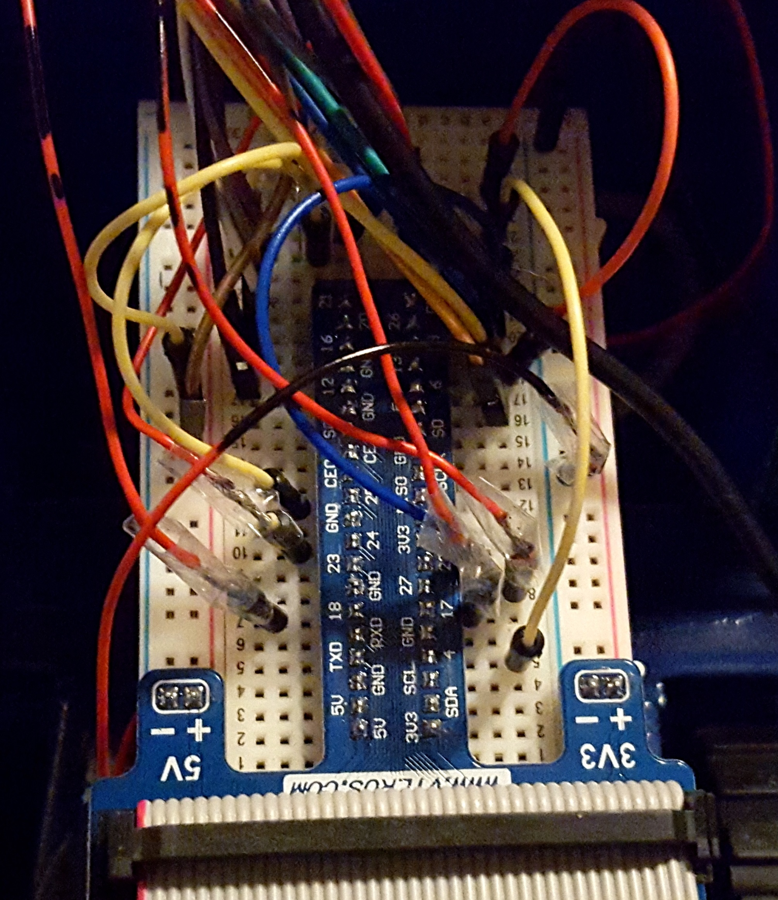

# RC-Truck

A remote toy truck extended with sensors and smartphone control

## Before vs. After

	

## Overview
The original truck was taken apart and augmented with sensors (camera, IR proximity sensors, LEDs, photoresistor). The remote control was replaced by an Android app connecting to an on-board RaspberryPi which then controls the car. The RaspberryPi accesses the truck's actuators through a soldered connection with the original board.

## Work progress
## 1. Take apart the truck

	

## 2. Identify the motor transistors for steering and gas

	

## 3. Solder connection to the existing board

	

## 4. Connect to RaspberryPi via breadboard

	

## 5. Add distance sensors and more

	

## 6. Put it all together

	

## 7. Write Android app

	

## 8. All done!

	

